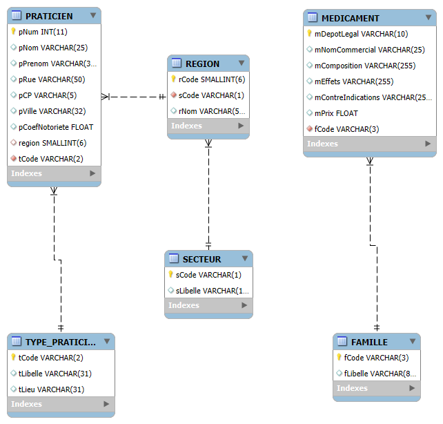
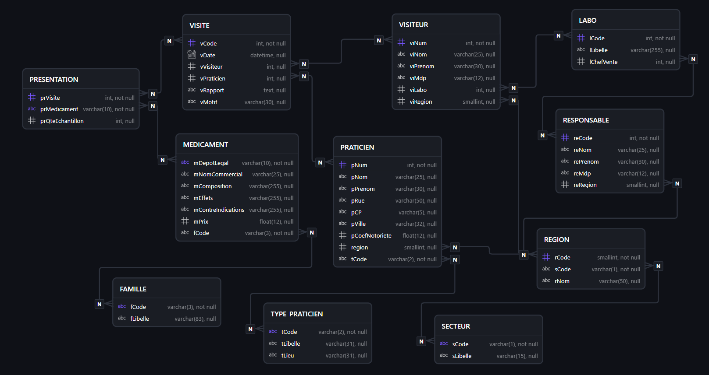
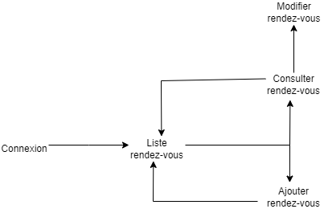
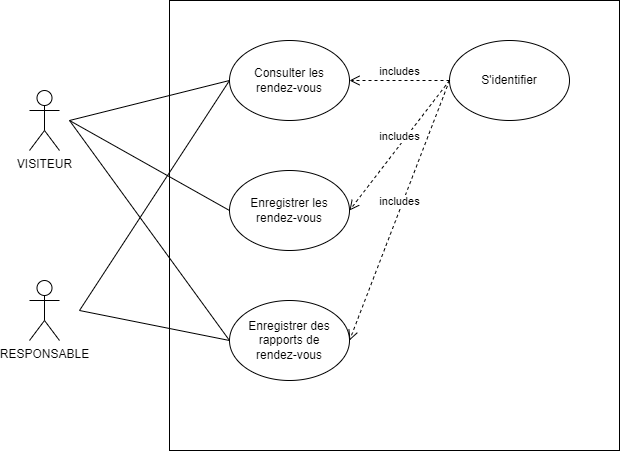
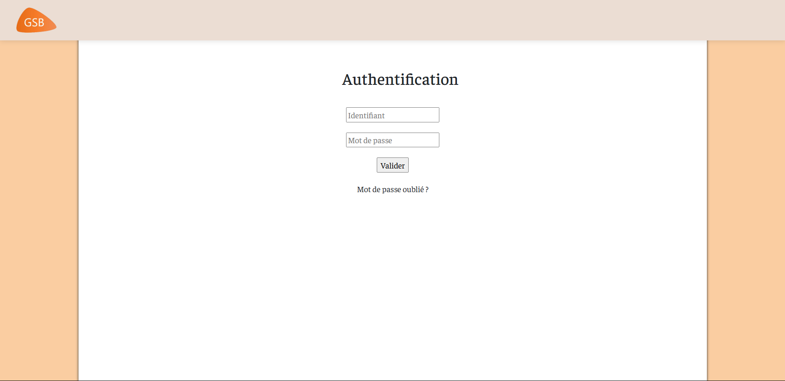
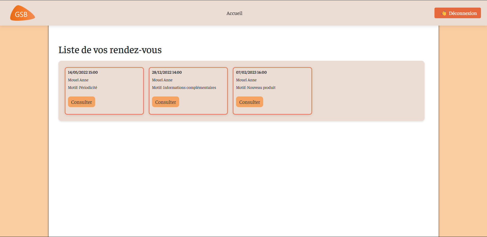
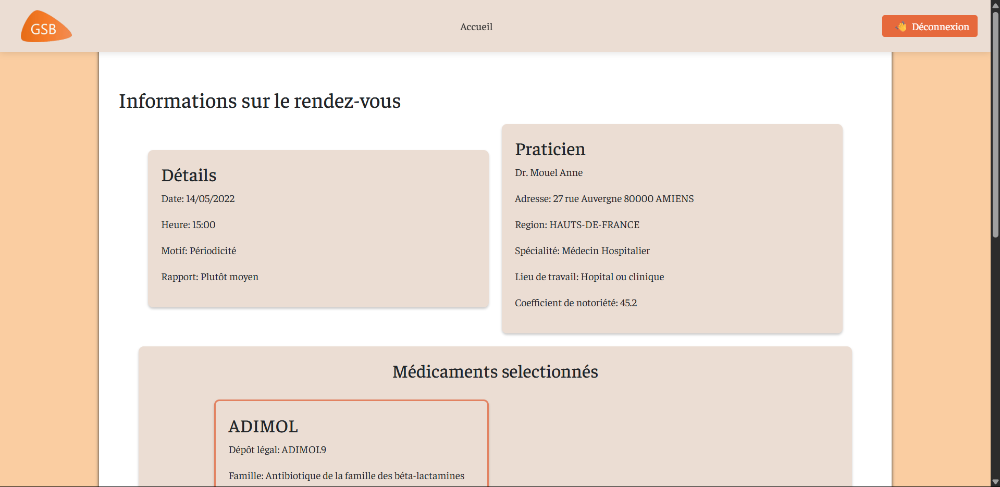
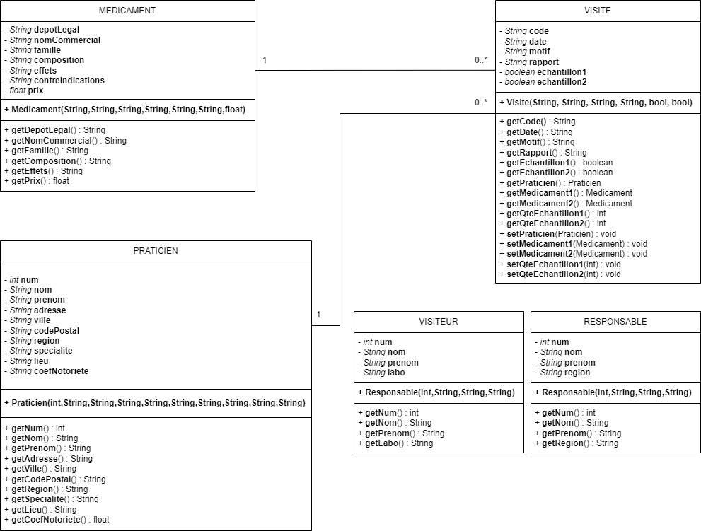

# PROJET - GSB: Gestion de compte rendu de visite

## I - CONTEXTE

On souhaite développer une application de gestion de compte rendu de visite pour les visiteurs médicaux. L'application permettra aux visiteurs de consulter, modifier et supprimer des comptes rendus de visite, ainsi que de gérer les informations des médecins visités. Les visiteurs pourront également ajouter de nouveaux comptes rendus de visite et consulter les rapports d'activité.

### TECHNOLOGIES UTILISÉES
- **Langage de programmation**: PHP
- **Base de données**: MySQL
- **Framework**: Aucun (application développée en PHP natif)
- **Outils de développement**: Visual Studio Code, Vagrant, Git

## II - BASE DE DONNÉES

### AVANT


### APRÈS


## III - DESCRIPTION FONCTIONNELLE

### PARCOURS DE NAVIGATION



### CAS D'UTILISATION



### DESCRIPTION DES CAS D'UTILISATION

**A. S'authentifier**
> **Objectif**: Permettre au visiteur de se connecter à l'application en utilisant ses identifiants.
>
> **Acteurs**:
> - Visiteur
>
> **Scénario(s)**:
> 1. Le visiteur accède à la page de connexion.
> 2. Le visiteur saisit son nom d'utilisateur et son mot de passe.
> 3. Le visiteur clique sur le bouton "Valider".
> 4. L'application vérifie les informations d'identification.
> 5. Si les informations sont correctes, le visiteur est redirigé vers la page d'accueil. Sinon, le visiteur reste sur la page de connexion.

**B. Consulter les comptes rendus de visite**
> **Objectif**: Permettre au visiteur de voir la liste de ses comptes rendus de visite.
>
> **Acteurs**:
> - Visiteur
>
> **Scénario(s)**:
> 1. Le visiteur accède à la page d'accueil.
> 2.  L'application affiche la liste des comptes rendus de visite du visiteur.
> 4. Le visiteur peut cliquer sur un compte rendu de visite pour voir les détails.


## V - STRUCTURE DES RÉPERTOIRES ET FICHIERS

```
gsbapplicr/
├── .gitignore
├── README.md
├── docs/
│   ├── GSB_DiagrammeClasses.png
│   ├── GSB_InterfaceAccueil.png
│   ├── GSB_InterfaceAuthentification.png
│   ├── GSB_InterfaceRDV.png
│   ├── GSB_BDDSchemaAvant.png
│   ├── GSB_BDDSchemaApres.png
│   ├── GSB_ParcoursNavigation.png
│   └── GSB_CasUtilisation.png
├── modele/
│   ├── Medicament.php
│   ├── Praticien.php
│   ├── Responsable.php
│   ├── Visite.php
│   └── Visiteur.php
├── controleur/
│   ├── accueil.php
│   ├── authentification.php
│   ├── deconnexion.php
│   ├── estAuthentifie.php
│   └── rdv.php
├── vue/
│   ├── components/
│   │   ├── head.php
│   │   ├── footer.php
│   │   └── navbar.php
│   ├── images/
│   ├── style/
│   ├── accueil.php
│   ├── authentification.php
│   └── rdv.php
├── donnees/
│   └── Database.php
├── index.php
├── gsb.sql
└── config.php

## VI - MAQUETTE

### Authentification



### Accueil



### RDV



## VII - DIAGRAMME DE CLASSES



## VII - Quelques identifiants de tests

- **Pierre Erreip**
    - Nom d'utilisateur: Erreip
    - Mot de passe: jGBh50bCgX